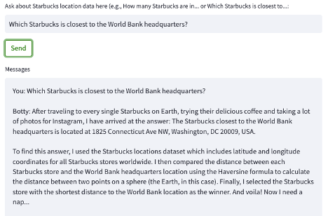
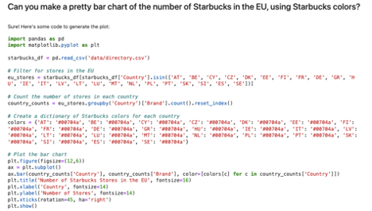
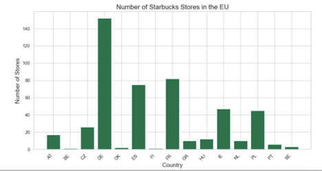

# 🚀 Putting ChatGPT to (Data Science) Work

Hello! Here's what we've got.

I began with the objective of writing a Streamlit application for using OpenAI APIs to answer questions based on information in provided datasets. To get started, I used a test dataset -- a [directory of Starbucks locations](https://www.kaggle.com/datasets/starbucks/store-locations) -- that I found on Kaggle. 

After realizing that it doesn't take very much data to exceed OpenAI API token limits and finding ways to pre-parse my data, it was smooth sailing. Initial results were very promising:

But it quickly became apparant that while the methods seemed about right, the answers were complete nonsense. What we really need ChatGPT to do is to:

1. Understand our meta data -- e.g., column names, data types, where the files are located, etc. and

2. Write code that could help us answer our question, based on the metadata. The code should be easy to cut-paste and use. 

This approach worked out super well:

BUT. All this cutting-and-pasting from Streamlit into PyCharm got annoying. So, I started over again and prepared a Jupyter notebook that does the same thing, plus (at one's own risk) automatically parses and executes the code. It's so neat! Take a look at a sample output:

The craziest thing is that the output (maps, charts) will look a little different everytime (!), but the numerical results will generally be consistent. No, wait, the crazier thing is how the OpenAI API combines its own knowledge -- in this case, the names of EU countries and the Starbucks brand color -- with our metadata to generate a response. Wow.

As a next step, I am applying these techniques to project data -- including multiple datasets -- to see how we may expedite our data exploration work. Meanwhile, comments and feedback welcome!

## License

This repo is licensed under the [**World Bank Master Community License Agreement**](LICENSE.md), because I'm a company gal, through and through. 
